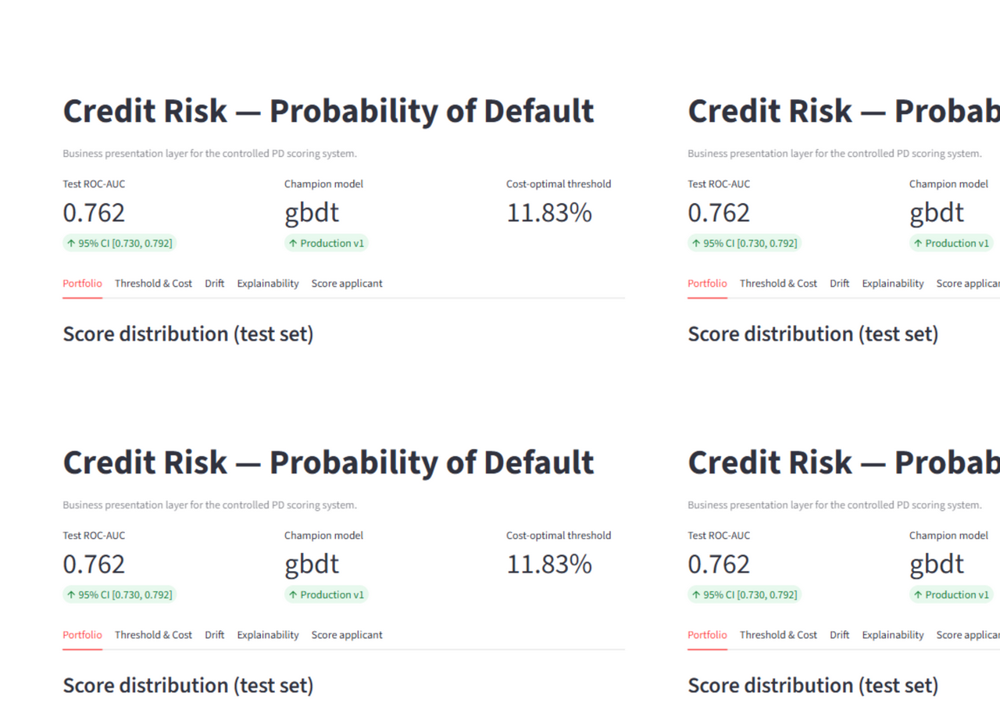
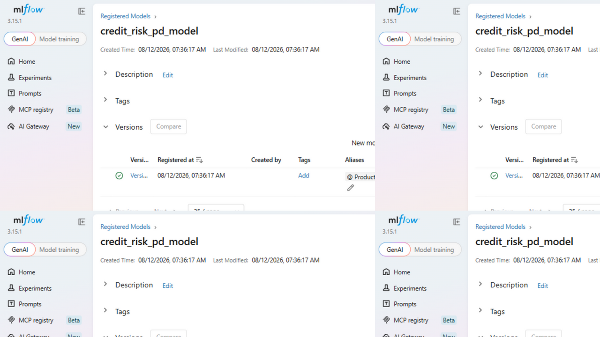
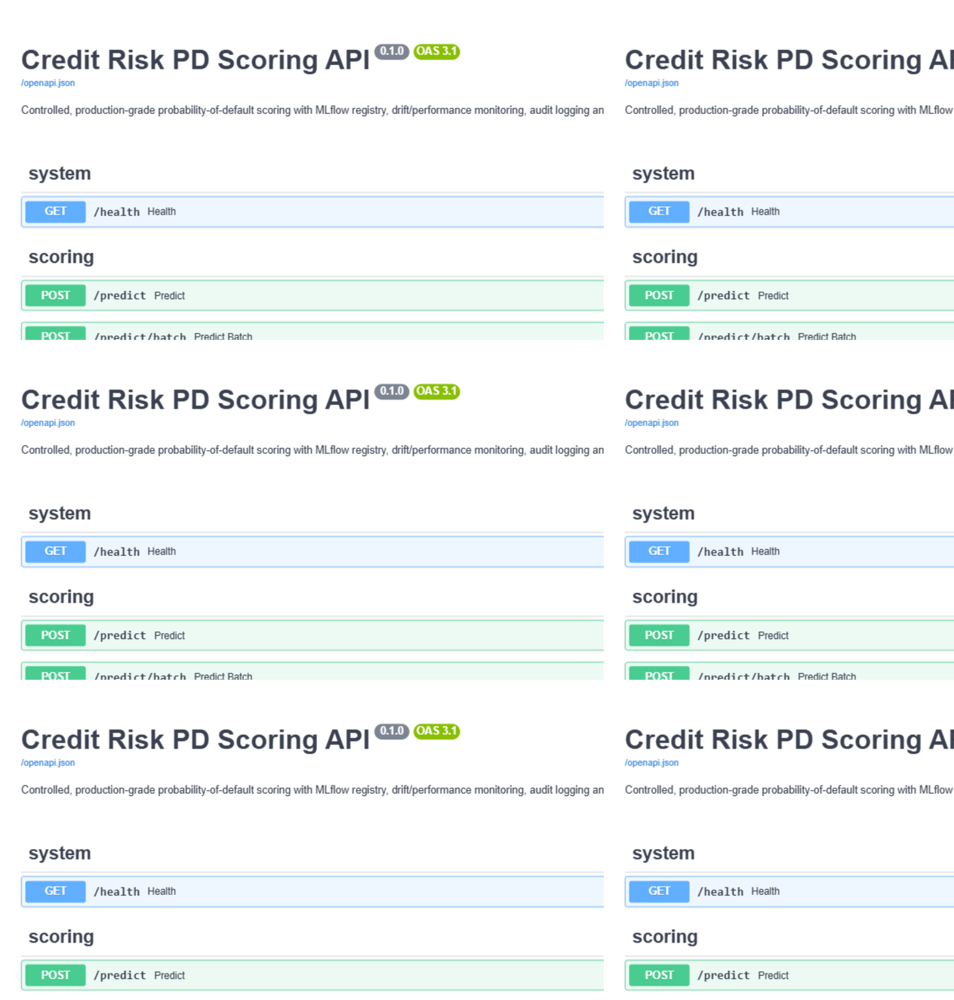
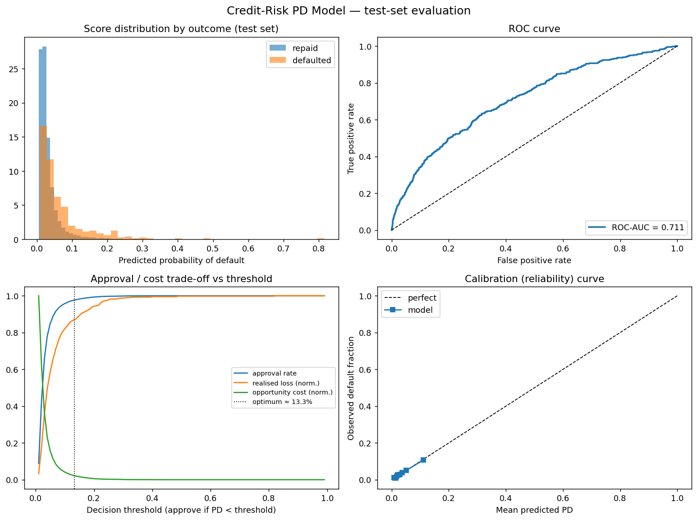
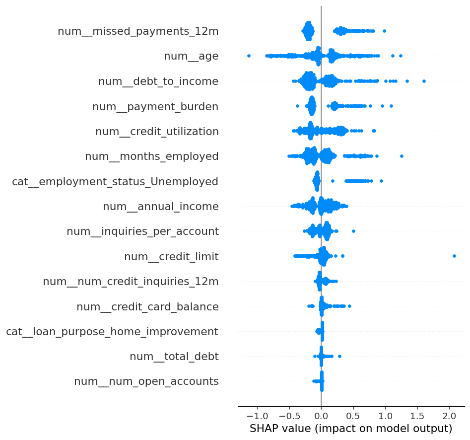
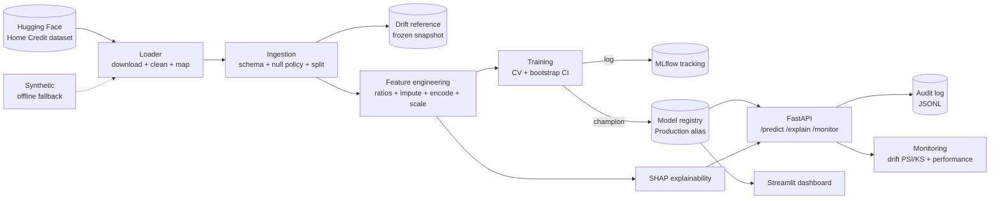

# Controlled Credit-Risk MLOps

> An end-to-end, production-grade **probability-of-default (PD) scoring system**
> built for a *well-controlled* environment: data ingestion → feature engineering
> → model training → **MLflow registry** → **FastAPI** serving → **drift &
> performance monitoring** → **audit logging**, with **SHAP** explainability, a
> business-impact model, a Streamlit dashboard, Docker + CI, and an **Azure**
> deployment guide.

This repository is intentionally one self-contained flagship project. It trains
on **real data from Hugging Face** — the [Home Credit Default Risk](https://huggingface.co/datasets/deburky/home-credit-credit-risk-model-stability)
benchmark (522k real loan applications) — so the model, the drift simulations
and the business-impact trade-offs reflect genuine credit-risk behaviour. A
schema-matched synthetic generator is bundled as an offline fallback.

---

## Problem statement

A controlled production environment needs a credit-decisioning model that is not
only accurate, but **governed, monitored, explainable and tied to money**:

- *Who* is the served model, and *which version*? (registry + alias gating)
- How do we know it's still valid in production? (drift + performance monitoring)
- Can we justify every decline? (SHAP reason codes + append-only audit log)
- What is it worth to the business? (expected-loss & cost-optimal thresholding)

---

## Headline results (champion model, Home Credit test set)

| Metric | Value |
|---|---|
| Dataset | Home Credit Default Risk — 60k stratified sample of 522k real applications (~3.3% default) |
| Champion model | XGBoost (`xgboost`) |
| Test ROC-AUC | **0.711** (95% CI **0.686 – 0.734**, 300-bootstrap) |
| Test PR-AUC | 0.104 (base default rate ≈ 3.3%) |
| CV ROC-AUC (5-fold) | 0.730 ± 0.013 |
| **Cost-optimal PD threshold** | **≈ 13.3%** (realised loss + opportunity cost minimised) |
| Approval rate @ optimum | 97.6% (declines only the highest-risk tail) |

> The threshold is chosen to minimise **realised loss (false negatives × LGD × EAD)
> + opportunity cost (false positives × foregone profit)**, not to maximise F1 —
> the framing that matters in a risk-controlled setting. The dashboard's
> interactive slider lets you explore the full approval/loss trade-off.

---

## Gallery

| Streamlit dashboard | MLflow registry (Production alias) |
|---|---|
|  |  |

| FastAPI Swagger docs | Test-set evaluation |
|---|---|
|  |  |

<details>
<summary>Global SHAP summary (click to expand)</summary>


</details>

---

## Architecture



---

## Repository structure

```
controlled-credit-risk-mlops/
├─ config.yaml                 # single source of truth (thresholds, costs, model)
├─ Makefile                    # data / train / serve / test / dashboard
├─ pyproject.toml              # package + ruff + pytest config
├─ Dockerfile, docker-compose.yml, .github/workflows/ci.yml
├─ src/credit_risk/
│  ├─ config.py                # config loader (env overrides, path resolution)
│  ├─ data/{huggingface,synthetic,ingestion}.py   # HF source + offline fallback + ingest
│  ├─ features/engineering.py     # sklearn pipeline (ratios + impute + encode + scale)
│  ├─ models/{train,registry,explainability}.py
│  ├─ serving/{app,schemas}.py          # FastAPI
│  ├─ monitoring/{drift,performance,audit}.py
│  ├─ business.py              # expected loss + cost-optimal threshold
│  └─ utils/{logging,io}.py
├─ tests/                      # data, features, business, drift, audit, serving, train
├─ notebooks/01_eda_and_validation.py
├─ dashboard/app.py            # Streamlit
└─ deployment/azure/           # azureml_train.py + submit_job.py + guide + architecture
```

---

## Quickstart

```bash
# 1. Install (editable, with dev + dashboard extras)
make install            # or: pip install -e ".[dev,dashboard]"

# 2. Download real data (Home Credit, from Hugging Face) + train + register
make data               # `make data-synthetic` for the offline fallback
make train              # logs to MLflow, registers v1, promotes to Production

# 3. Serve the Production model
make serve              # http://127.0.0.1:8000

# 4. (optional) Business dashboard + MLflow UI
make dashboard          # Streamlit on :8501
make mlflow-ui          # tracking UI on :5000
```

Smoke-test the API:

```bash
curl -s http://127.0.0.1:8000/health
# {"status":"ok","model_name":"credit_risk_pd_model","model_version":1,"stage":"Production",...}

curl -s -X POST http://127.0.0.1:8000/predict -H "Content-Type: application/json" -d '{
  "age":40,"income":55000,"credit_amount":60000,"total_debt":9000,"current_debt":5000,
  "num_active_credits":1,"num_credit_inquiries":2,"recent_applications":1,
  "max_dpd_12m":0,"num_installments":3,
  "sex":"F","education":"level_3","income_type":"EMPLOYED",
  "family_status":"MARRIED","employment_duration":"MORE_FIVE"}'
# {"pd_score":...,"decision":"APPROVE","reasons":[...]}
```

### Docker

```bash
make data && make train        # produce ./data and ./mlruns locally first
docker compose up -d           # API on :8000 + MLflow UI on :5000
```

---

## API reference

| Method | Path | Purpose |
|---|---|---|
| `GET`  | `/health` | Model pin (name, version, stage, threshold); `ok`/`degraded` |
| `POST` | `/predict` | Single applicant → PD, decision, SHAP reason codes |
| `POST` | `/predict/batch` | Batch → predictions (+ drift snapshot if ≥20 rows) |
| `POST` | `/monitor/drift` | PSI/KS report of a batch vs the frozen reference |
| `POST` | `/monitor/performance` | Realised metrics + threshold-breach alerts (needs labels) |
| `GET`  | `/metrics` | Operational snapshot (model pin + audit volume) |

Every `/predict` is written to the append-only **audit log** with model name +
version, timestamp, a feature hash, the PD, the decision and the reason codes.

---

## Monitoring & governance features

- **Drift detection** (`monitoring/drift.py`): Population Stability Index (PSI)
  on numeric features + KS test, category-frequency PSI on categoricals, and a
  PSI on the score distribution — all measured against a **frozen reference**.
  Governed thresholds live in `config.yaml` (warn 0.10 / fail 0.25).
- **Performance monitoring** (`monitoring/performance.py`): realised ROC-AUC,
  precision, default-rate drift vs reference, with configurable alert thresholds.
- **Audit logging** (`monitoring/audit.py`): append-only JSONL; deterministic
  feature hash per decision for traceability.
- **Registry gating** (`models/registry.py`): only the `Production` alias is
  served; promotion is an explicit, logged action (MLflow 3 alias API, with a
  legacy stage fallback).
- **Reproducibility**: single `config.yaml`, pinned dependencies, seed control,
  Dockerfile, and CI that trains end-to-end on every push.

---

## Business impact model (`business.py`)

Two lenses on cost, used by the dashboard and the threshold optimiser:

- **Forward-looking expected loss** of the approved book: `Σ PD · LGD · EAD`
  (usable at scoring time, before outcomes are known).
- **Realised total cost** used to tune the threshold:
  `realised_loss (FN · LGD · EAD) + opportunity_cost (FP · cost_false_positive)`.

`business.optimal_threshold` finds the PD cutoff that minimises realised total
cost. The Streamlit dashboard exposes an interactive simulator so business users
can explore the approval-rate vs loss trade-off.

---

## Azure deployment

The system is Azure-agnostic by design; only thin adapters are Azure-specific.
See [`deployment/azure/`](deployment/azure/README.md):

- `azureml_train.py` — the same training, packaged as an AML-ready entry point
  (runs locally, auto-detects the AML workspace context).
- `architecture.md` — reference architecture mapping every repo component to an
  Azure service (ADLS Gen2, Data Factory, AML registry, managed online endpoint,
  Log Analytics, Entra ID managed identities) plus the control/governance model.

---

## Testing

```bash
make test        # pytest (data, features, business, drift, audit, serving, train)
make lint        # ruff
```

CI (`.github/workflows/ci.yml`) runs three jobs on every push: **lint + unit
tests**, an **end-to-end** job (data → train → register → live smoke test), and a
**Docker build**.

---

## Design notes & honest limitations

- **Data**: trained on the real **Home Credit Default Risk** dataset from Hugging
  Face (60k stratified sample of 522k applications, ~3.3% default). AUC ≈ 0.71 is
  realistic for this benchmark with the selected feature set — Home Credit is
  genuinely hard. A schema-matched synthetic generator is bundled for offline/CI
  use (`make data-synthetic`); to use your own data, point `data.huggingface` in
  `config.yaml` at another HF dataset or replace the loader — every downstream
  stage is data-agnostic.
- **Models**: scikit-learn (LogisticRegression baseline + GradientBoosting) plus
  **XGBoost** as a third candidate — the champion (XGBoost on this data) is
  selected by CV ROC-AUC. The pipeline/registry abstractions make swapping in
  other estimators a one-line change.
- **Statistical validation**: stratified k-fold CV + bootstrap AUC CI +
  calibration curve (see `notebooks/01_eda_and_validation.py`).
- **MLflow 3**: uses the modern **alias**-based registry; falls back to stages
  transparently on older installs.
