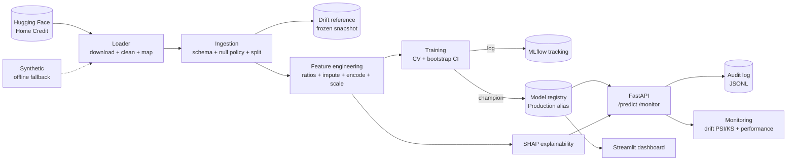

# Controlled Credit-Risk MLOps

[](https://github.com/twomathematicians-code/controlled-credit-risk-mlops/actions/workflows/ci.yml)
[](https://www.python.org/)
[](https://fastapi.tiangolo.com/)
[](https://mlflow.org/)
[](https://streamlit.io/)
[](LICENSE)

> A production-style **probability-of-default (PD)** scoring system built for a
> *well-controlled* environment — from data ingestion to a monitored, explainable
> served model — trained on **real credit data from Hugging Face**.

**Why this project?** Three things that matter in risk/AI engineering, demonstrated end-to-end:

- 🏦 **Real data** — the [Home Credit Default Risk](https://huggingface.co/datasets/deburky/home-credit-credit-risk-model-stability) benchmark (522k real loan applications).
- 🔁 **Full lifecycle** — ingestion → features → training → **MLflow registry** → **FastAPI** → **drift/performance monitoring** → **audit** → SHAP + dashboard.
- 🛡️ **Governed by design** — only the `Production`-tagged model is served; every decision is explained and audit-logged; thresholds and costs live in one config.

---

## Highlights

| | |
|---|---|
| 📊 **Real data pipeline** | Home Credit via Hugging Face → clean schema → stratified sample → validated splits |
| 🧠 **Model selection** | Logistic Regression · Gradient Boosting · **XGBoost** — chosen by cross-validated ROC-AUC |
| 📝 **Registry & versioning** | MLflow Model Registry with a `Production` alias; explicit, logged promotion |
| 🚀 **Serving** | FastAPI: `/predict`, `/predict/batch`, `/monitor/*` — with **SHAP** reason codes |
| 🩺 **Monitoring** | Drift (PSI + KS) & performance alerts vs a frozen reference snapshot |
| 📜 **Audit** | Append-only JSONL: model version, feature hash, PD, decision, reasons |
| 💶 **Business impact** | Expected Loss (PD × LGD × EAD) + cost-optimal decision threshold |
| 🐳 **Reproducible** | Docker + docker-compose, GitHub Actions CI, pinned deps, seed control |

---

## Results

Trained on a 60k stratified sample of 522k Home Credit applications (~3.3% default). Champion = **XGBoost**.

| Metric | Value |
|---|---|
| Test ROC-AUC | **0.711** (95% CI **0.686 – 0.734**, 300-bootstrap) |
| Test PR-AUC | 0.104 |
| CV ROC-AUC (5-fold) | 0.730 ± 0.013 |
| Cost-optimal PD threshold | ≈ 13.3% |

AUC ≈ 0.71 is the realistic range for this benchmark — the value of this project is the **engineering and governance around the model**, not a leaderboard number.

---

## Gallery

| Streamlit dashboard | MLflow registry (`Production` alias) |
|---|---|
|  |  |

| FastAPI Swagger docs | Test-set evaluation |
|---|---|
|  |  |

<details>
<summary>Global SHAP summary</summary>


</details>

---

## How it works



**One key idea:** the *same* sklearn feature pipeline transforms data at train time and at serve time, so live requests can never silently drift from what the model was trained on.

---

## Repository structure

```
controlled-credit-risk-mlops/
├─ config.yaml                 # single source of truth (features, thresholds, costs)
├─ Makefile                    # data / train / serve / test / dashboard
├─ src/credit_risk/
│  ├─ config.py                # config loader (env overrides, path resolution)
│  ├─ data/
│  │  ├─ huggingface.py        # primary source: Home Credit download + clean + sample
│  │  ├─ synthetic.py          # offline fallback (schema-matched)
│  │  └─ ingestion.py          # schema validation, null policy, splits, drift reference
│  ├─ features/engineering.py  # sklearn pipeline (ratios + impute + encode + scale)
│  ├─ models/
│  │  ├─ train.py              # CV + bootstrap CI, MLflow logging, registration
│  │  ├─ registry.py           # MLflow registry: promote/load Production model
│  │  └─ explainability.py     # SHAP global + per-prediction reason codes
│  ├─ serving/{app,schemas}.py # FastAPI + Pydantic contract
│  ├─ monitoring/
│  │  ├─ drift.py              # PSI + KS vs frozen reference
│  │  ├─ performance.py        # realised metrics + governed alerts
│  │  └─ audit.py              # append-only JSONL audit trail
│  ├─ business.py              # expected loss + cost-optimal threshold
│  └─ utils/{logging,io}.py
├─ dashboard/app.py            # Streamlit business dashboard
├─ tests/                      # data, features, business, drift, audit, serving, train
├─ notebooks/                  # EDA + statistical validation
├─ docs/                       # README figures + figure generator
├─ deployment/azure/           # AML-ready training script + architecture + guide
├─ Dockerfile, docker-compose.yml, .github/workflows/ci.yml
```

---

## Quickstart

**Prerequisites:** Python 3.10+ and network access (the default data source is Hugging Face).

```bash
git clone https://github.com/twomathematicians-code/controlled-credit-risk-mlops
cd controlled-credit-risk-mlops

make install            # pip install -e ".[dev,dashboard]"
make data               # download Home Credit from Hugging Face + ingest
make train              # train → log to MLflow → register champion → Production
make serve              # FastAPI on http://127.0.0.1:8000
```

Smoke-test the API:

```bash
curl -s http://127.0.0.1:8000/health
# {"status":"ok","model_name":"credit_risk_pd_model","model_version":1,"stage":"Production",...}

curl -s -X POST http://127.0.0.1:8000/predict -H "Content-Type: application/json" -d '{
  "age":40,"income":55000,"credit_amount":60000,"total_debt":9000,"current_debt":5000,
  "num_active_credits":1,"num_credit_inquiries":2,"recent_applications":1,
  "max_dpd_12m":0,"num_installments":3,
  "sex":"F","education":"level_3","income_type":"EMPLOYED",
  "family_status":"MARRIED","employment_duration":"MORE_FIVE"}'
# {"pd_score":...,"decision":"APPROVE","reasons":[...]}
```

Other targets: `make dashboard` (Streamlit :8501) · `make mlflow-ui` (:5000) · `make test` · `make data-synthetic` (offline fallback).

---

## API reference

| Method | Path | Purpose |
|---|---|---|
| `GET`  | `/health` | Model pin (name, version, stage, threshold); `ok`/`degraded` |
| `POST` | `/predict` | Single applicant → PD, decision, SHAP reason codes |
| `POST` | `/predict/batch` | Batch → predictions (+ drift snapshot if ≥20 rows) |
| `POST` | `/monitor/drift` | PSI/KS report of a batch vs the frozen reference |
| `POST` | `/monitor/performance` | Realised metrics + threshold-breach alerts (needs labels) |
| `GET`  | `/metrics` | Operational snapshot (model pin + audit volume) |

Every `/predict` is written to the append-only **audit log** with model name + version, timestamp, a feature hash, the PD, the decision and the reason codes.

---

## Monitoring & governance

- **Drift** — Population Stability Index (numeric) + KS test, category-frequency PSI, and score-distribution PSI, all measured against a **frozen reference**. Governed thresholds live in `config.yaml` (warn 0.10 / fail 0.25).
- **Performance** — realised ROC-AUC, precision, default-rate drift, with configurable alert thresholds.
- **Audit** — append-only JSONL; deterministic feature hash per decision.
- **Registry gating** — only the `Production` alias is served; promotion is an explicit, logged action (MLflow 3 alias API, with a legacy stage fallback).

---

## Business impact

Two lenses on cost (`src/credit_risk/business.py`):

- **Forward-looking expected loss** of the approved book: `Σ PD · LGD · EAD` (usable before outcomes are known).
- **Realised total cost** used to tune the threshold: `realised loss (FN · LGD · EAD) + opportunity cost (FP · cost_false_positive)`.

`optimal_threshold` finds the cutoff that minimises realised total cost. The dashboard exposes an interactive simulator so you can explore the approval-rate vs loss trade-off.

---

## Testing & CI

```bash
make test     # pytest — data, features, business, drift, audit, serving, train
make lint     # ruff
```

CI (`.github/workflows/ci.yml`) runs three jobs per push: **lint + unit tests**, an **end-to-end** job (data → train → register → live smoke test), and a **Docker build**.

---

## Deploy

- **Docker** — `make data && make train` then `docker compose up -d` (API :8000 + MLflow UI :5000).
- **Streamlit Community Cloud** — the dashboard is self-bootstrapping (trains a fast model in memory if no artifacts exist). See [`dashboard/README.md`](dashboard/README.md): main file `dashboard/app.py`, requirements `dashboard/requirements.txt`.
- **Azure** — [`deployment/azure/`](deployment/azure/README.md): an AML-ready training entry point, conda environment, and a reference architecture mapping every component to Azure services (ADLS Gen2, Data Factory, AML registry, managed online endpoint, Log Analytics, Entra managed identities) plus the control model.

---

## Tech stack

`Python` · `scikit-learn` · `XGBoost` · `pandas` · `MLflow` · `FastAPI` · `SHAP` · `Streamlit` · `Docker` · `GitHub Actions` · `Hugging Face` · `Azure ML` (guide)

---

## Limitations & roadmap

- Sampled subset of Home Credit with a selected feature set — not competition-depth engineering.
- AUC ≈ 0.71 is a demonstration of the *engineering/governance*, not a deployable lending model.
- **Next:** probability calibration (Platt/isotonic), time-based stability testing, a retrain trigger wired to drift alerts, champion–challenger serving.

---

## License

[MIT](LICENSE) — built for demonstration and learning.
